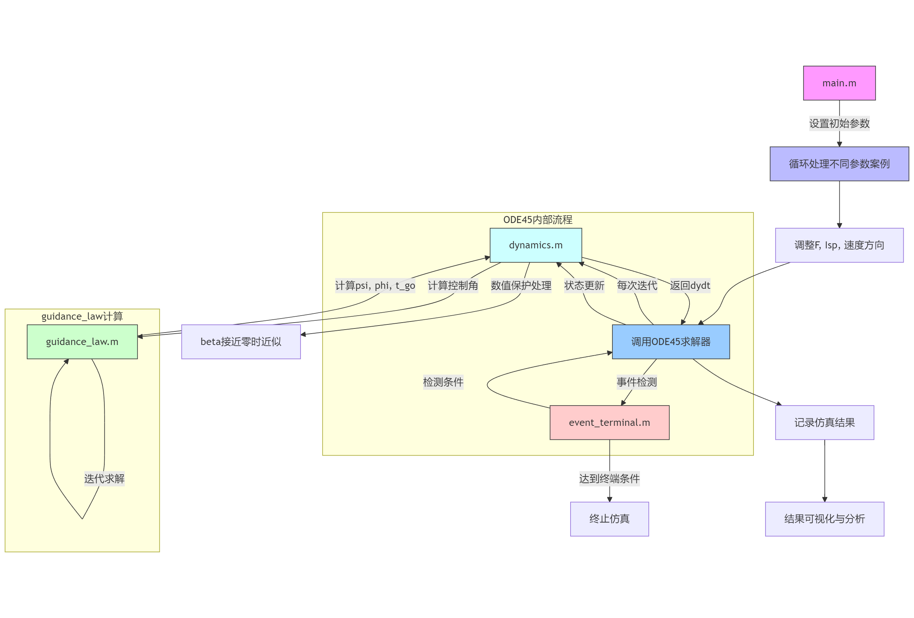

# Lunar-soft-landing-control

# 月球软着陆控制系统综合仿真实验
本实验通过建立月球软着陆动力学模型，设计了基于多项式显式制导的燃耗次优控制方案，并利用MATLAB对主制动段进行仿真。实验分析了推力偏差（±10%）、比冲偏差（±10%）以及初始速度方向对软着陆过程的影响。代码已开源，并提供了仿真结果的演示视频。

## 主要结论  
1. **推力偏差**：推力增大10%可缩短9.7%的制动时间，但仅减少0.56%的燃料消耗；推力减小10%则延长12.1%的时间并增加0.93%的燃料消耗。  
2. **比冲偏差**：比冲降低10%会导致燃料消耗增加7.4%，而提高10%可减少6.5%的燃料消耗。  
3. **初始速度方向偏差**：  
   - x轴方向偏差5°会导致终端经度偏移约5°；  
   - y轴方向偏差会引发剧烈径向速度变化，需高精度导航支持。
4. **初始质量偏差**：初始质量的偏差会显著影响着陆时间和燃料消耗     
5. **终端误差**：纬度误差主要由横向速度收敛特性决定，经度误差可忽略（<0.1°）。  

## 实验流程 

